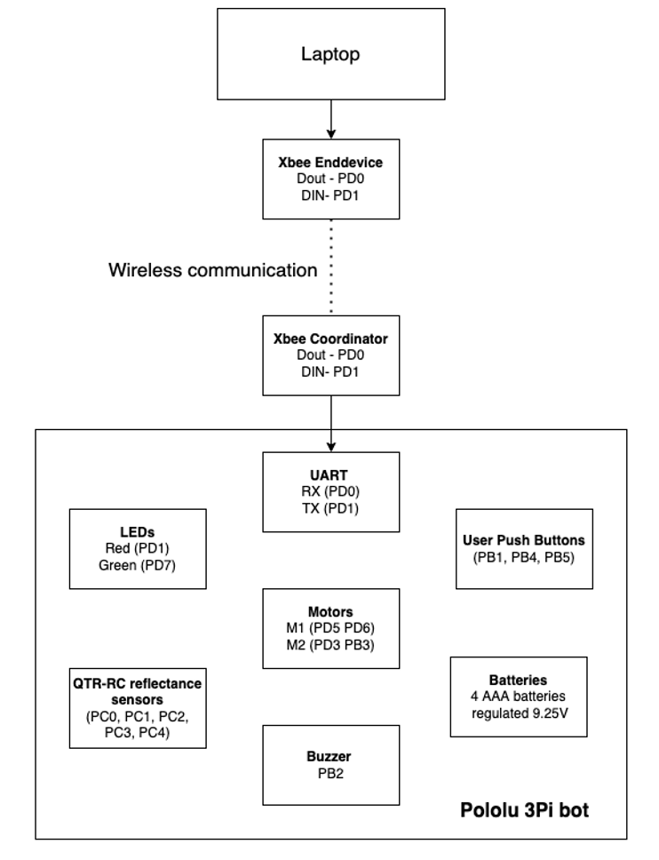
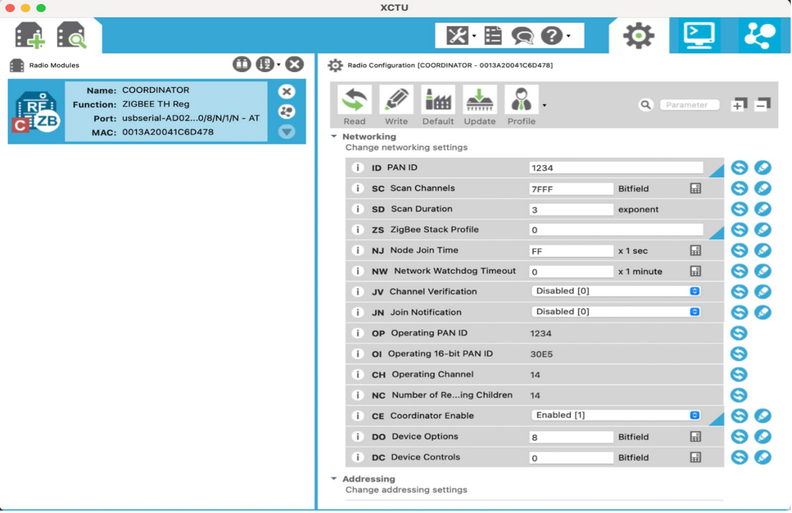
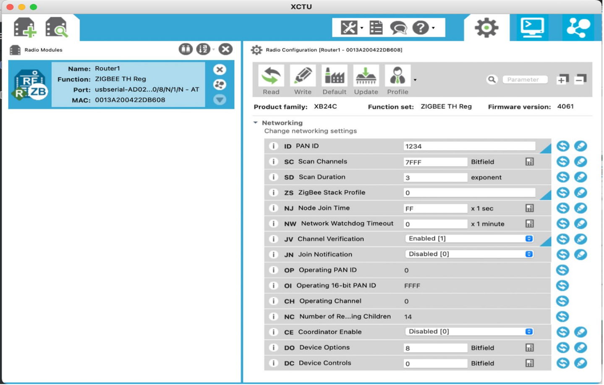
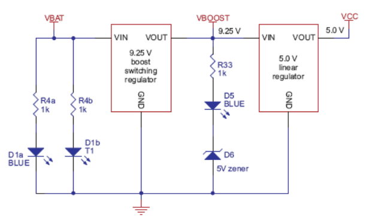
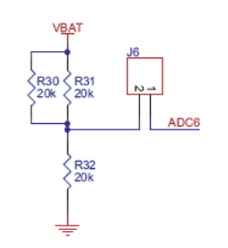

# NSYNC-Project-Website
NSYNC Project Report

## 1. Abstract

### 1.1 Overview

Swarm analysis investigates the collaborative dynamics of multiple autonomous agents working collectively to achieve shared objectives. Rooted in natural systems such as ant colonies, bee hives, and bird flocks, the field explores how simple, local interactions among individual agents give rise to complex, efficient, and adaptive group behaviors. This decentralized approach, wherein agents follow straightforward rules and interact locally, enables swarms to adapt to environmental changes and maintain functionality even when individual components fail. These principles ensure robustness, resilience, and adaptability in both natural and engineered systems, particularly in robotics.

Drawing inspiration from biological and ecological systems, swarm analysis examines how social insects and animals exhibit sophisticated group behaviors that allow them to perform critical tasks like foraging, building, and protection. Ants, for instance, employ pheromone trails for efficient resource discovery, while bees utilize the "waggle dance" for directing hives toward nectar sources. Similarly, flocking birds exhibit coordinated movements that enhance predator evasion and energy conservation. These natural systems demonstrate the power of decentralized, self-organized behaviors, where simple individual actions culminate in achieving complex group objectives, offering a model for robust, adaptive, and scalable systems.

### 1.2 Swarm analysis in robotics and warehouse application

Swarm robotics leverages principles inspired by nature to enable groups of autonomous robots to perform tasks collaboratively using simple rules and local interactions. This decentralized approach ensures dynamic task allocation, scalability, and robust adaptability to failures or environmental changes. By minimizing human intervention, swarm systems enhance efficiency, resilience, and sustainability in complex operational settings.

This project implements swarm robotics in a warehouse environment using a two-robot system. Each robot, powered by an ATmega328P microcontroller, is coordinated through an Xbee-based central controller that ensures synchronization and prevents task overlaps. The robots navigate, allocate tasks, and optimize energy usage, triggering alerts when batteries are low. This showcases the potential of scalable, efficient, and resilient robotic systems to improve warehouse automation and overall productivity through collaboration and energy-aware operations.

## 2. Motivation 

The rapid expansion of e-commerce and logistics industries has driven a significant demand for efficient and automated warehouse solutions. To meet rising consumer expectations and navigate the complexities of modern supply chains, businesses increasingly rely on automation to streamline operations and reduce costs.

<po>Swarm robotics presents an innovative approach to enhancing warehouse efficiency by reducing human intervention and improving overall operational effectiveness. The collaborative capabilities of swarms enable optimized task distribution and resource utilization, facilitating seamless workflows. By harnessing swarm intelligence, warehouses benefit from task allocation, accelerated decision-making, and improved scalability, achieving enhanced performance and efficient resource management.

## 3. Goals

The goals for this project have been revised to reflect updates in the hardware and functionality. Initially, the project intended to use ESP32 and ATmega328PB microcontrollers; however, the implementation now employs Pololu 3pi robots equipped with ATmega328P microcontrollers. The revised goals are as follows:

1.	Wireless Control: Enable seamless control of the robots using XBee RF modules for wireless communication. 
2.	Synchronized Bot Operations: Develop a two-bot system capable of executing synchronized tasks based on user inputs, including moving forward, backward, rotation, or line-following. 
3.	Battery Monitoring: Integrate real-time monitoring of each bot's battery level to ensure operational efficiency. 
4.	Low Battery Alert and Task Reallocation: Implement a system where a buzzer alerts when a bot’s battery is low, causing the bot to stop its wheels after a few seconds and reassign its tasks to the other bot to maintain uninterrupted operation. 

## 4. Block Diagram

 * This block diagram shows the setup for a single Pololu 3pi bot, highlighting key components like sensors, motors, LEDs, and communication with the laptop using XBee modules.

The project now integrates two such bots, both controlled wirelessly, working in sync to share and complete tasks while autonomously managing battery levels and task reassignment.

## 5. Software Requirments

The software system is designed to facilitate efficient wireless communication, monitoring, and task management between XBee modules, Pololu 3pi robots, and ATmega328P microcontrollers. Below are the detailed functionalities:

1. XBee Configuration Using XCTU Software
    •Purpose: The system enables configuration of XBee modules to establish wireless communication between devices. 
    •Functionality: 
        Users can use the XCTU software to set up XBee modules for communication between the laptop, XBee end devices, and Pololu 3pi robots. 
2. Message Display and Communication 
    •Message Display: 
    The system displays messages exchanged between the laptop and XBee modules on a terminal interface via UART protocol, allowing real-time monitoring of communication. 
    •Communication Support: 
    It ensures robust and seamless communication between XBee modules and ATmega328P microcontrollers. 
    Task commands, status updates, and alerts are transmitted reliably, ensuring the operation of the connected devices. 
3. Battery Monitoring and Alerts 
    •Real-Time Monitoring: 
    The system continuously monitors the battery voltage of the connected devices and displays the voltage levels on the terminal. 

    •Alerts for Low Battery: 
    If the battery voltage drops below a predefined safety threshold, the system generates a "Battery Low!" alert.
4. Task Assignment and Reallocation 

    User-Defined Commands: Users can input specific commands via XCTU software to assign tasks to the robots. Examples include: 
    Input 1: Assign Bot 1 a specific task, such as rotating or other predefined actions. 
    Input 2: Assign Bot 2 its designated task. 

### 5.1 Process of Configuring Xbee Modules and Wireless Communication

To achieve seamless wireless communication between the two Pololu 3pi bots and the laptop, we utilized the XBee S2C modules. The system was configured with one module as the Coordinator and the other two modules as Routers, following the process described below. 

Configuration Process: 
1. Hardware Setup: 
    • The XBee S2C modules were connected to USB XBee adapters and linked to the laptop via USB ports. XCTU software was used to configure the modules. 
    • The Coordinator and Router roles were assigned to the modules using XCTU. 

2. Coordinator Configuration: 
        The first module was set as the Coordinator with the following parameters: 
        • PAN ID: 1234 (common network ID for all modules). 
        • CE (Coordinator Enable): Enabled. 
        • Destination Address DL: Set to FFFF (broadcast mode to communicate with all devices in the PAN ID). 
        • The configuration was saved by clicking the "Write" button in XCTU. 
3.	Router Configuration: The other two modules were configured as Routers with the following parameters: 
• PAN ID: 1234 (same as the Coordinator). 
• CE (Coordinator Enable): Disabled. 
• Destination Address DL: Defaulted to 0 (addressing the Coordinator). 
• Configuration was saved for each module. 

4.	Testing Communication: 

    • Two instances of XCTU software were opened on the laptop, one for the Coordinator and the other for a Router. 
    • The Terminal mode in XCTU was used to test communication between the devices. Messages typed in one module's terminal were successfully transmitted and displayed on the other module's terminal, confirming proper configuration and functionality. 
    • The communication was reliable, with transmitted messages appearing in blue and received messages in red, as seen in the attached screenshots. 

Below screenshots show the configuration of xbee modules:

## 6. Hardware Requirments

1. XBee S2C Modules 
•Purpose: Wireless communication between the laptop, robots, and microcontrollers. 
    •Key Requirements: 
    Configurable using XCTU software for seamless communication. 
    Reliable data transmission and reception for task assignment and monitoring. 
    Proper antenna alignment and baud rate matching. 

2. Pololu 3pi Robots 
•Purpose: Serve as the robotic platforms for executing tasks. 
    •Key Features: 
    Equipped with onboard motor drivers for precise motor control. 
    Built-in IR sensors for line following and object detection. 
    Expandable with external modules like XBee for wireless operations. 

3. ATmega328P Microcontroller (built in pololu 3pi bot) 
•Purpose: Process commands, control motors, and handle peripheral components. 
    •Key Requirements: 
    Interfacing capability with XBee modules. 
    Support for pushbutton controls for manual task testing. 
    ADC functionality to monitor battery voltage. 

4. Motors 
•Purpose: Perform movement tasks as commanded. 
    •Key Requirements: 
    Compatible with the Pololu 3pi motor drivers. 
    Reliable operation for tasks such as rotating and navigation. 

5. Buzzer 
•Purpose: Provide audio alerts for specific conditions (e.g., low battery). 
    •Key Features: 
    Triggered by battery voltage monitoring via the ADC. 
    Stops operation of the bot to conserve energy when triggered. 

6. LEDs 
•Purpose: Provide visual feedback during operations. 
    •Key Requirements: 
    Indicate successful data transmission or task execution. 
    Clear visibility in all operating environments. 

7. Pushbuttons 
•Purpose: Allow manual testing of bot operations and features. 
    •Key Requirements: 
    Responsive and easy to integrate with the microcontroller. 
    Configurable for triggering specific tasks or actions. 

8. Battery and Power Monitoring 
•Purpose: Power supply for the bots and real-time voltage monitoring. 
    •Key Requirements: 
    Rechargeable batteries with a predefined voltage threshold. 
    ADC input (e.g., ADC6 pin) for voltage monitoring. 
    Integration with a warning system (buzzer and message transmission). 

9. IR (QTR) Sensors 
•Purpose: Detect nearby objects and enable automated responses. 
    •Key Requirements: 
    Accurate detection of objects within proximity. 
    Trigger motor activation upon detection. 
    Calibration to handle varying reflectivity of surfaces. 

## 7. Main Issues Faced

### 7.1 Baud Rate Mismatch

During the configuration and testing of the XBee communication with the ATmega328P microcontroller, we encountered a significant issue with the baud rate. Despite configuring the system to operate at a baud rate of <b>115200</b>, we observed an error in data transmission. The data received was inconsistent and appeared to be sent at approximately <b>140000 baud</b>, leading to about <b>20% error in UART communication.</b>

• <b>Root Cause:</b>

After thorough debugging, we realized that the ATmega328P microcontroller was operating at a 20 MHz clock frequency instead of the expected 16 MHz. The incorrect assumption of the clock frequency had resulted in inaccurate prescaler calculations for the UART baud rate, causing the mismatch.

• <b>Resolution</b>:To resolve this issue:

• <b>Prescaler Adjustment:</b> We recalculated the prescaler value for the UART baud rate based on the 20 MHz clock frequency, ensuring accurate baud rate settings.

• Verification with <b>Saleae Logic Analyzer:</b>
    We used a Saleae Logic Analyzer to analyze the transmitted and received UART signals.
    The logic analyzer allowed us to confirm the actual baud rate being transmitted and verify that the adjusted prescaler correctly aligned the transmission rate with the configured baud rate of 115200.

## 8. Power Management

• The power management system in the 3pi robot is a sophisticated design that ensures optimal performance for the device, even as battery voltage fluctuates during operation. The system addresses the challenge of inconsistent battery voltage from four AAA cells, which can range between 3.5 V and 5.5 V (or even up to 6 V for alkaline batteries). This variability makes direct voltage regulation to 5 V impractical. To overcome this, the 3pi employs a dual-regulation approach, utilizing both a switching regulator and a linear regulator.

• First, the switching regulator boosts the battery voltage to a stable 9.25 V (Vboost), which is used to power the motors and IR LEDs in the line sensors. Then, a linear regulator reduces Vboost to 5 V (VCC), supplying the microcontroller and digital circuitry. This dual-regulation method provides several advantages. The motors benefit from higher voltage and, consequently, more power without increased current demand, enabling consistent performance regardless of battery depletion. Additionally, the regulated voltage ensures that motor speeds remain constant, simplifying programming tasks such as timed turns. Furthermore, the higher voltage enables the IR LEDs to be powered in series, minimizing power consumption.

• The system also incorporates a voltage monitoring circuit to help track battery status. This is achieved using a voltage divider, which scales the battery voltage to a level safely below the microcontroller's 5 V maximum analog input. This scaled voltage is fed to an ADC input and converted into the actual battery voltage using a simple formula. We monitored the battery voltage by a function, read_battery_millivolts_3pi(), that automates this process by averaging ten ADC samples and returning the battery voltage in millivolts.

• In summary, the 3pi’s power management system ensures maximum performance until the battery is fully drained, offering regulated voltage for reliable operation of all components while monitoring battery health for proactive power management.

## 9. Detailed Explaination of Hardware Implementation

### 9.1 Motors

The Pololu 3pi robot uses brushed DC motors with a gear ratio of 30:1, which are ideal for the lightweight and agile design of the 3pi robot. The details are as follows: 

### Motor Design and Characteristics: 
•Brushed DC Motor: The motors operate with permanent magnets and electromagnetic coils, offering a reliable mechanism for the small and efficient Pololu 3pi. 
#### Key Specifications: 
• Free-Running Speed: 700 rpm (rotations per minute) without any load. 
• Free-Running Current: 60 mA, ensuring low power consumption during operation. 
• Stall Torque: 6 oz-in (ounce-inches), providing sufficient force for the robot to overcome minor obstacles. 
• Stall Current: 540 mA, which the motor draws under maximum load conditions. 

#### Gear Ratio and Torque: 
• A 30:1 gear ratio is employed, which reduces the speed and increases the torque by a factor of 30. This is crucial for tasks like: 
    Precise movement during line-following. 
    Overcoming resistance from friction or uneven surfaces. 
•The gear ratio ensures that even though the motor spins rapidly, the robot achieves smooth and controlled movements.
Differential Drive System: 
•Each wheel of the 3pi robot is connected to an independent motor, enabling tank-style movement: 
    Both motors moving forward at the same speed: The robot moves straight. 
    One motor faster than the other: The robot turns. 
    Motors moving in opposite directions: The robot spins in place. 
•This setup allows the robot to make sharp turns and maintain a steady trajectory along the line. 
PWM Control: 
•Pulse Width Modulation (PWM): The motor speed is controlled by varying the duty cycle of the PWM signal. 
•The onboard TB6612FNG motor driver chip generates PWM signals linked to the Timer2 in the ATmega328 microcontroller. 
•By changing the PWM duty cycle, the motors achieve: 
    Smooth acceleration and deceleration: Gradual adjustments in speed ensure stability. 
    Precise directional control: The robot follows curves with minimal overshooting. 

### 9.2 Sensors

The Pololu 3pi uses five reflectance sensors mounted underneath the chassis for line detection. These sensors are critical for determining the position of the robot on a line and ensuring accurate navigation. Here's a detailed breakdown: 
Reflectance Sensor Design: 
•Phototransistor-Based Sensors: The sensors use phototransistors to measure reflected light intensity. Bright surfaces reflect more light, while dark surfaces reflect less. 
•The key components include: 
    Infrared Emitter: Sends light to the surface. 
    Phototransistor Detector: Measures the amount of reflected infrared light. 
Operation of Reflectance Sensors: 
•The reflectance sensors are connected to the microcontroller’s digital inputs, such as PC0 (Port C). 
•A capacitor discharge mechanism is used: 
    The sensor pin is charged to 5V and then set to an input. 
    The capacitor discharges through the phototransistor, and the rate of discharge depends on the reflectance. 
    The microcontroller measures the time taken for the pin to drop below a certain threshold voltage. 
•Output Range: 
    White surfaces cause rapid discharge and low sensor values. 
    Black surfaces cause slow discharge and high sensor values. 
Sensor Layout and Coverage: 
•Five sensors are arranged in a row beneath the robot, ensuring wide coverage of the line. 
•This layout allows the robot to detect curves and edges effectively, maintaining its trajectory even in complex paths. 

### 9.3 Mircrocontroller and H-Bridge Motor Driver

Microcontroller: ATmega328 
•The ATmega328P microcontroller handles motor control, sensor data processing, and high-level decision-making. 
•Timers and Ports Used: 
    Timer2: Generates PWM signals for motor speed control. 
    Port C (PC0-PC4): Interfaces with the reflectance sensors. 
H-Bridge Motor Driver: 
•The onboard TB6612FNG motor driver chip uses H-Bridge circuits to control motor direction. 
•Directional Logic: 
    Motors are controlled by toggling the logic levels of PD5, PD6 (Motor 1) and PD3, PB3 (Motor 2). 
    Example configurations: 
    PD5 = 1, PD6 = 0: Motor 1 moves forward. 
    PD5 = 0, PD6 = 1: Motor 1 reverses. 
•Coasting and Braking: 
    Motors can be set to coast (no movement) or brake (immediate stop) by configuring the H-Bridge logic. 
4. Buttons and Additional Inputs 
Buttons for User Control: 
•PB4 (Button B): Used for toggling between starting and stopping the robot. 
    The button is connected with a pull-up resistor to avoid floating input values. 
    Pressing the button sets the corresponding input to logic low (0), triggering the desired functionality in the firmware. 

### 10. Video Implementations

Video link to final demo:
[Link](https://drive.google.com/file/d/18RFZoYMZ_O98KFYrI4eGMwchdLWHGtCn/view?usp=drive_link)

Link showing interfacing led and pushbuttons:
[Link](https://drive.google.com/file/d/1S4Z-eInoQ7wf2noCODETjuOZ1mt6ME1N/view?usp=sharing)

Link to showing working of buzzer and led blinking:
[Link](https://drive.google.com/file/d/1IsLDWu6bf9tx6z9PqTOx2AZyhzqks5P4/view?usp=drive_link)

Link to video showing working of IR sesnosrs:
[Link](https://drive.google.com/file/d/1L7b0nwyDtBVQVn3g3IIqXnq-lpMjQe97/view?usp=drive_link)

Link to video showing wirless communication between 2 xbees:
[Link](https://drive.google.com/file/d/1N9SaClY3qcYWlyZ3d0JNDajOq4S42tjL/view?usp=sharing)

Link showing wireless communication from xbee to atmega:
[Link](https://drive.google.com/file/d/1um7ZsDng7-yxWcuwBKc0DoomefzdZ1Ut/view?usp=drive_link)

Link showing wireless communication from atmega to xbee:
[Link](https://drive.google.com/file/d/19bvlWNmOn_qIHddz2FfXGzltxhePZOj-/view?usp=drive_link)

Link to a video showcasing the wireless control of the bot's motors:
 [Link](https://drive.google.com/file/d/1foPRAMkwSOQCrFttxfK9oeal0Zd3ZwFI/view?usp=drive_link)

Link to a video showing Motor and QTR sensors working together (Facing Calibration Issues):
  [Link](https://drive.google.com/file/d/1ZaagUqCAhBXo545llPBmGqV77pNaJmeO/view?usp=drive_link)

### 11.  Hardware Implementation

